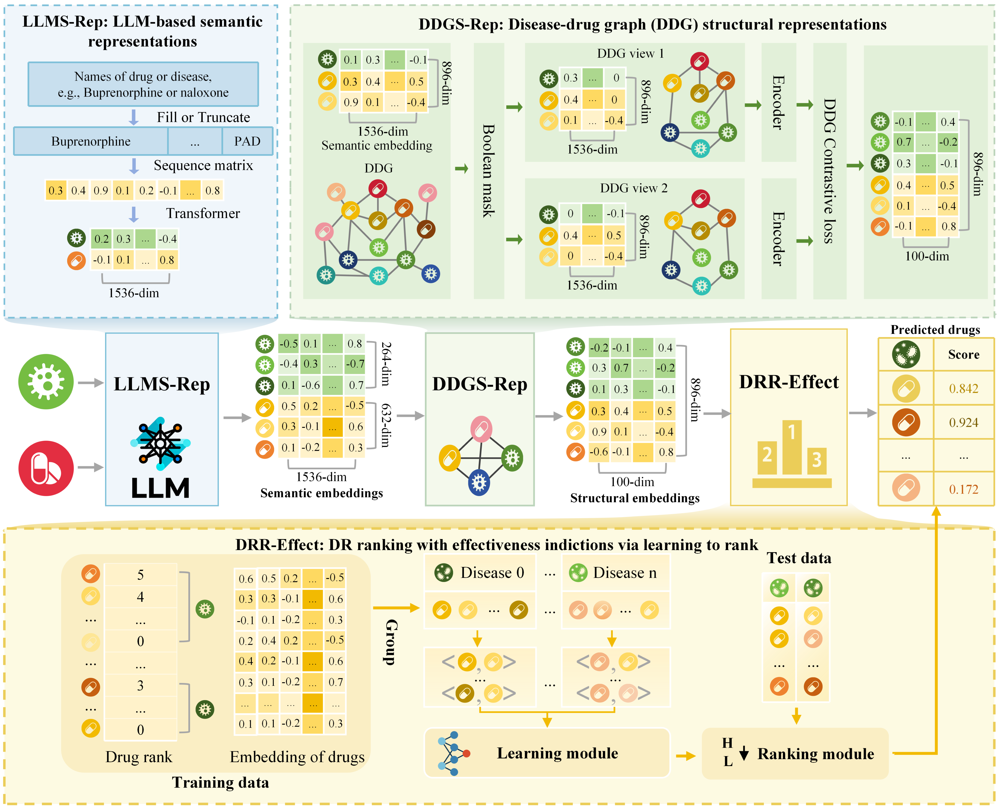

# DeepRepurpose: A Clinical Effectiveness-Aware Drug Repurposing Platform via LLM-Enhanced Graph Contrastive Learning

# 1.Introduction

This repository contains the source code and datasets for the paper **"DeepRepurpose: A Clinical Effectiveness-Aware Drug Repurposing Platform via LLM-Enhanced Graph Contrastive Learning"**. DeepRepurpose is an LLM-enhanced graph contrastive learning framework for drug repositioning with clinical effectiveness indications. The framework jointly models biomedical entity semantic knowledge, drug--disease graph structural information, and drug effectiveness comparison relationships. Specifically, DeepRepurpose first generates semantic representations of drugs and diseases through the LLMS-Rep module, then learns graph structural representations through the DDGS-Rep module, and finally ranks candidate drugs for each disease through the DRR-Effect module based on learning-to-rank.

# 2. Overview



DeepRepurpose consists of three key modules: 

1. **LLMS-Rep: LLM-based Semantic Representations**     This module uses large language models to generate semantic embeddings of standardized drug and disease terms. 
2. **DDGS-Rep: Disease--Drug Graph Structural Representations**     This module integrates LLM-derived semantic embeddings with the drug--disease graph and learns structural representations through graph contrastive learning. 
3. **DRR-Effect: Drug Repositioning Ranking with Effectiveness Indications via Learning to Rank**     This module incorporates drug effectiveness comparison relationships and ranks candidate drugs for each queried disease.

# 3.Install Python libraries needed

```bash
conda create -n DeepRepurpose python=3.8
conda activate DeepRepurpose
pip install -r requirements.txt
```

# 4.Methods

DeepRepurpose follows a three-stage workflow. First, the LLMS-Rep module obtains LLM-based semantic representations of drugs and diseases. Second, the DDGS-Rep module takes these semantic embeddings and the drug--disease graph as input, and further learns graph structural representations through graph contrastive learning. Finally, the DRR-Effect module uses the learned drug and disease representations together with drug effectiveness comparison relationships to perform learning-to-rank and predict the ranking of candidate drugs for each disease.

To ensure that different source codes can run successfully in our framework, we modify part of their source code where necessary.

## 4.1 LLMS-Rep: LLM-based Semantic Representations

### 4.1.1 Dataset

- semantic_feature/dataset/disease_id.xlsx: The names and IDs of the diseases
- semantic_feature/dataset/drug_id.xlsx: The names and IDs of the drugs

### 4.1.2 Running

  ```python
  cd semantic_feature
  ```
  ```python
  python -u chatGPT.py
  ```

### 4.1.3 Output

- drug_id_vector.xlsx: Drug features output by the large language model
- disease_id_vector.xlsx: Disease features output by the large language model

## 4.2 DDGS-Rep: Disease--Drug Graph Structural Representations

### 4.2.1 Dataset

- structural_feature/dataset/disease_drug_vector.xlsx: Features output by the large language model(The first 263 features are disease features and the rest are drug features)
- structural_feature/dataset/dis_drug_list(all).csv: drug-disease、drug-drug and disease-disease association data 
- structural_feature/dataset/dis_drug_list(only dis_drug).xlsx:  drug-disease association data 

### 4.2.2 Running

- run MA_GCL model

  ```python
  cd structural_feature/MA_GCL
  ```
  ```python
  python -u main.py
  ```

- run GIN_Recover model

  ```python
  cd structural_feature/GIN_Recover
  ```
  ```python
  python -u MyModel.py
  ```

- run All in one model 

  ```python
  cd structural_feature/All in one
  ```
  ```python
  python -u NE.py
  ```

### 4.2.3 Output

- structural_feature/MA_GCL/output _features.xlsx: drug features and disease features output by the MA_GCL
- structural_feature/GIN_Recover/output _features.xlsx: drug features and disease features output by the GIN_Recover
- structural_feature/All in one/output _features.csv: drug features and disease features output by the All in one

## 4.3  DRR-Effect: Drug Repositioning Ranking with Effectiveness Indications via Learning to Rank

### 4.3.1 Dataset

- structural_feature/dataset/train_origin.xlsx: the training dataset without drug features for LTR model
- structural_feature/dataset/test_origin.xlsx: the testing dataset without drug features for LTR model
- structural_feature/{ModelName}/output_features.xlsx: drug features and disease features output by the DDGS-Rep module

**We need to go through the following process to generate the dataset for the LTR model（We can refer to the file "structural_feature/handle_file.py" for details）:**

1. We fill the drug features output by the GNN (located in 'structural_feature/{ModelName}/output _features.xlsx') into the 'emb' column in the 'train_origin.xlsx' and 'test_origin.xlsx' files. The 'emb' column should contain a list of feature values, formatted as "1:feature_value 2:feature_value ... 100:feature_value".
2. We extracted three columns of data from 'train_origin.xlsx' and 'test_origin.xlsx': disease ID, drug effectiveness rank, and drug feature.  These columns are then used to form the training set and test set. Finally, we generate the files 'train_dataset.txt' and 'test_dataset.txt' from the prepared data.

### 4.3.2 Running

​	You can run LTR model under LTR folder

- run LambdaRank model

  ```python
  python -u main.py --method LambdaRank --input_train ./mydata2/train_dataset.txt --input_test ./mydata2/test_dataset.txt --output ./resultdata/LambRank/example_LambRank_1v5.txt
  LambdaMART
  ```

- run LambdaMART model 

  ```python
  python -u main.py --method LambdaMART --input_train ./mydata2/train_dataset.txt --input_test ./mydata2/test_datset.txt --lr_LM 0.001 --output ./resultdata/LambdaMart/example_LambdaMART_1v5.txt
  ```

- run RankNet model

  ```python
  python -u main.py --method RankNet --input_train ./mydata2/train_dataset.txt --input_test ./mydata2/test_dataset.txt --output ./resultdata/example_rankNet_ran_1v1.txt
  ```

- run PLRank model

  ```python
  cd PLRank
  ```
  ```python
  python -u runrank.py
  python -u plltr.py
  ```
  
- --method: The learning-to-rank method, such as `RankNet`, `LambdaRank`, or `LambdaMART`.
- --input_train: the path of train dataset file
- --input_test: the path of test dataset file
- -- output: the path of output